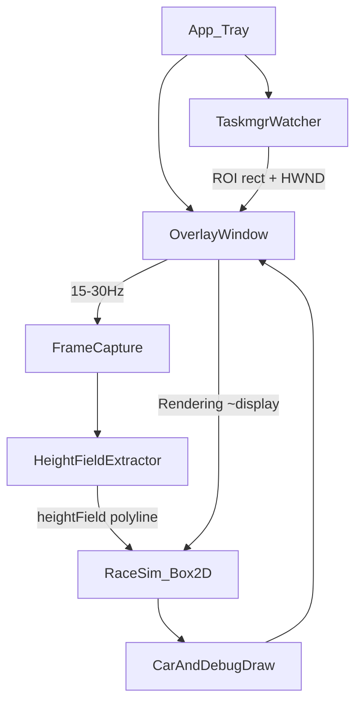

# CPURacer 实施计划

> 依据：[docs/调研报告.md](调研报告.md)  
> 范围：Win11 中文新版任务管理器 · 外部 Overlay · 不注入  
> 目标：按 M0→M3 交付可玩原型，再做打磨与降级

---

## 0. 目标与非目标

### 0.1 目标（MVP / PoC）

- 在 Taskmgr「性能 → CPU」大图上叠加透明 Overlay  
- 从**合成帧**提取与蓝线拟合的山路 `heightField` / polyline  
- 带物理的侧视小车：贴地、可翻车；**唯一死亡 = 被卷轴带出视口**  
- 托盘常驻、标准用户（`asInvoker`）、PerMonitorV2 DPI  

### 0.2 非目标（本阶段不做）

- DLL 注入 / Hook Taskmgr  
- Win10 经典 Taskmgr 双实现  
- 逻辑处理器多图模式  
- 精美美术、联网、成就、安装器打磨（可放 M4+）  
- 以 PDH 自绘假图作为唯一赛道（仅作降级）  

### 0.3 技术栈（锁定）

| 层 | 选型 |
|---|---|
| 运行时 | .NET 8（优先）或与参考接近的 .NET Framework 4.8；**新建独立工程，不改子模块** |
| UI | WPF 透明 Overlay + WinForms/`NotifyIcon` 托盘 |
| 发现 | `Taskmgr.exe` → `TaskManagerWindow` → 面积最大 `CvChartWindow` |
| 捕获 | Windows Graphics Capture（首选）或 DPI 正确的屏幕 ROI 复制；**禁止**用 BitBlt 当蓝线来源 |
| 物理 | Box2D（如 `Box2D.NetStandard`） |
| 清单 | `PerMonitorV2`、`asInvoker`；全程 `IntPtr` 句柄 |

---

## 1. 仓库与工程结构

```text
CPURacer/
  docs/
    调研报告.md
    实施计划.md          ← 本文
    research/            ← 探针留存，不进产品编译
  reference/
    copy-dialog-lunar-lander/   ← submodule，只读参考
  src/
    CPURacer.sln
    CPURacer.App/               ← 托盘入口、应用生命周期
    CPURacer.Taskmgr/           ← Watcher、HWND/UIA、ROI
    CPURacer.Capture/           ← 合成帧捕获、高度场提取
    CPURacer.Overlay/           ← 透明窗、对齐、帧循环、调试描边
    CPURacer.Game/              ← 赛车物理、输入、胜负
    CPURacer.Native/            ← P/Invoke（可选合并进 Utils）
  tests/
    CPURacer.Tests/            ← 高度场/坐标换算单测（能测的部分）
```

模块依赖方向（禁止反向）：

```text
App → Overlay → Game
App → Taskmgr
Overlay → Capture → Taskmgr(ROI)
Game 不依赖 Win32 捕获细节（只吃 heightField + 时间步）
```

参考项目仅作对照阅读；**禁止**直接改 `reference/` 当产品代码。

---

## 2. 架构与数据流



### 2.1 坐标系约定（全项目统一）

1. **物理像素**：捕获与 `GetWindowRect` / Graphics Capture 使用  
2. **DIU**：WPF Overlay 布局（÷ DPI × 96）  
3. **世界坐标**：Box2D，原点建议图区左下，Y 向上；与参考 lunar-lander 一致便于移植心智  

换算必须集中在一个 `CoordMapper` 类，禁止各处手写。

### 2.2 帧率策略

| 通路 | 频率 | 说明 |
|---|---|---|
| 捕获 + 高度场 | 15–30 Hz | 限频，避免高刷机过热 |
| 物理步进 | 与 `CompositionTarget.Rendering` 绑定，dt 钳制 | 参考：fps 下限 30 保稳定 |
| Overlay 跟随矩形 | 每渲染帧或与捕获同频 | M1 先每帧跟随即可 |

---

## 3. 里程碑计划

### M0 — 工程骨架（0.5–1 天）

**交付：**

- 解决方案可编译运行；托盘图标；空透明窗可显示/退出  
- `app.manifest`：DPI + `asInvoker`  
- README 增加「如何编译运行」小节  

**验收：** F5 出托盘；退出干净；无管理员提权提示。

**任务清单：**

- [x] 创建 `src/CPURacer.sln` 与上述项目  
- [x] 托盘菜单：开始/停止跟踪、调试开关占位、退出  
- [x] 链接调研结论到 README  

---

### M1 — 钉住 CPU 大图并跟随（2–4 天）

**目标：** Overlay 客户区与 Taskmgr 主 CPU 图（最大 `CvChartWindow`）重合。

**任务清单：**

- [x] `TaskmgrWatcher`：按进程名找 `Taskmgr.exe`；枚举 `TaskManagerWindow`  
- [x] 子树收集可见 `CvChartWindow`，按面积选最大者作为 ROI  
- [x] 可选：检测侧栏多缩略图并存，启发式确认在「性能」页  
- [x] Overlay：`AllowsTransparency`、Alpha≥1、`Topmost`、`ShowInTaskbar=false`  
- [x] 每帧/定时更新 `Left/Top/Width/Height`（物理→DIU）  
- [x] 前台逻辑：Taskmgr 或 Overlay 为前台时显示，否则移出屏幕（参考 `Top=20000`）  
- [x] 切离性能页 / 找不到大图 → Sleep  
- [x] 调试：半透明红框描边 ROI（确认对准绘图区而非含大标题的过大矩形）  

**验收：**

| 场景 | 通过标准 |
|---|---|
| 打开 Taskmgr → 性能 → CPU | Overlay 盖住大图 |
| 拖动 / 缩放窗口 | 框跟随，无明显滞后错位 |
| 切到「进程」 | Overlay 隐藏 |
| 150% DPI | 不系统性偏大/偏小 |
| 跨屏拖动（若有条件） | 记录问题；允许 M1 有小瑕疵，记入债 |

**风险：** ROI 可能含标题「% 利用率」——M1 可用手动 inset 常量，M2 再精细裁剪绘图区。

---

### M2 — 合成帧高度场 + 拟合验收（4–7 天）

**目标：** 调试描边与系统蓝线肉眼重合；为物理提供可信地形。

**任务清单：**

- [ ] `FrameCapture`：优先 Windows Graphics Capture 捕获 Taskmgr 或桌面 ROI；fallback：DPI 感知进程内 `CopyFromScreen`  
- [ ] **禁止**将 `CvChartWindow` BitBlt 结果当作蓝线来源（可用其仅验证网格/尺寸）  
- [ ] `HeightFieldExtractor`：  
  - 主题色估计（饱和度众数，适配浅/深色）  
  - 逐列取面积上边缘或折线描边 → `float[] heightField`  
  - 轻度平滑（防抖）但避免削峰导致「看着贴、碰着空」  
- [ ] 绘图区 inset：去掉标题/底部署名，保证 0–100% 纵轴映射正确  
- [ ] 环形缓冲 + **卷速估计**（相邻帧特征相关或右端新数据推进），与图滚动对齐  
- [ ] Overlay 调试模式：半透明 polyline 叠在系统图上  
- [ ] 量化：采样列上 `|y_extract - y_visual|` 相对图高；目标 **≤ 1–2%**  
- [ ] PDH 旁路读取：仅日志对比，**不驱动**主地形  
- [ ] 主题切换（浅/深）冒烟：主题色重估成功  

**验收：**

- 调试线与蓝线重合（静止 CPU 约 25% 平台、波动段峰谷都要对）  
- 遮挡 Taskmgr 时：明确 Sleep 或进入「捕获失败」状态，不画错位山  
- 文档记录：捕获 API 最终选型与已知失败模式  

**退出标准未达时：** 不进入 M3 接物理（避免浮空车返工）。

---

### M3 — 物理赛车可玩原型（5–8 天）

**目标：** 能玩；规则符合调研 §1.2。

**任务清单：**

- [ ] `RaceSim`：Box2D 世界；地形 = edge chain ← `heightField`（分块脏更新，参考 lunar-lander）  
- [ ] 车辆：车身 + 轮或简化多边形；重力、摩擦；可翻车  
- [ ] 卷轴：世界随图向后滚；车需相对前进以免出界  
- [ ] 输入：油门/刹车（方向键或 WASD）；翻车后削弱或切断有效操控  
- [ ] **死亡**：车 AABB/质心离开图表可见矩形 → Game Over；翻车不单独判死  
- [ ] 重开：空格或托盘；重置位姿到视口内安全点（如左侧缓坡）  
- [ ] 绘制：只画车与简单 HUD（速度/存活提示）；**不**自绘第二条山路（调试线可关）  
- [ ] 捕获与物理解耦：高度场更新频率可低于渲染  

**验收：**

| 项 | 标准 |
|---|---|
| 贴地 | 正常路段车轮/底盘贴蓝线，无持续浮空 |
| 翻车 | 陡坡可翻；翻后难再控 |
| 死亡 | 仅出视口触发；重开可用 |
| 滚动 | CPU 波动时需主动「往前开」才不易被卷走 |
| 焦点 | Taskmgr 前台可操作；失焦不挡点击 |

---

### M4 — 降级、稳健与发布预备（可选，3–5 天）

在 M3 可玩后再做：

- [ ] 捕获连续失败 → PDH 影子山路 + 明确 UI 提示「降级模式」  
- [ ] 找不到 `CvChartWindow` → 客户区比例裁剪 fallback  
- [ ] 管理员 Taskmgr + 标准用户游戏：检测并提示  
- [ ] 启动自检（探针式）：写 `docs/research/self-check` 日志  
- [ ] 基础安装/单文件发布、代码签名（若需要）  
- [ ] 已知问题写入 README  

---

## 4. 关键模块设计要点

### 4.1 TaskmgrWatcher

```text
Poll / WinEvent（MVP 用 100–200ms 轮询即可）
  → Process.GetProcessesByName("Taskmgr")
  → Enum top-level ClassName == TaskManagerWindow
  → Enum children ClassName == CvChartWindow && visible
  → Pick max (width*height)
  → Emit ChartRoiChanged(rectPx, hwnd, dpi)
```

文案「性能」「CPU」只作可选加分，不作唯一条件。

### 4.2 HeightFieldExtractor（拟合硬路径）

输入：ROI 位图（合成帧）  
输出：`heightField[0..w)` ∈ [0,1]，及可选 `ScrollVelocityPxPerSec`

失败条件：主题色丢失、有效列命中率过低、ROI 尺寸突变 → 通知 Overlay 进入失败态。

### 4.3 RaceSim 与死亡

- 视口 = 当前 Overlay/图表世界矩形  
- `IsOutOfView(body)` → `Dead`  
- 翻车：`Abs(angle) > threshold` 或轮全部离地过久 → `ControlsDisabled`  

### 4.4 从参考项目可抄 / 不可抄

| 可借鉴 | 不可照搬 |
|---|---|
| Overlay 透明、焦点、`Top=20000` | `OperationStatusWindow` / `ChartView` 类名 |
| `GameInterface` 式 Init/Update | BitBlt + 自底向上实心色带算法 |
| Box2D 分块地形脏更新 | 固定 395×85 世界 |
| 托盘壳 | `NativeWindowHandle` 截断为 `int` |

---

## 5. 测试与验收矩阵

| ID | 类型 | 内容 | 阶段 |
|---|---|---|---|
| T1 | 手工 | Overlay 对准大图 | M1 |
| T2 | 手工 | 拖动/缩放跟随 | M1 |
| T3 | 手工 | 调试线拟合蓝线（平台+尖峰） | M2 |
| T4 | 手工 | 浅色/深色主题 | M2 |
| T5 | 手工 | 贴地无浮空、翻车、出界死亡 | M3 |
| T6 | 单测 | `CoordMapper` 像素↔世界 | M1+ |
| T7 | 单测 | 合成图 fixture → heightField 形状 | M2 |
| T8 | 手工 | 遮挡/最小化 Sleep | M2–M3 |
| T9 | 手工 | 150% DPI | M1–M3 |

测试夹具：将 `docs/research/capture-*.png` 中可用帧（或新录合成帧）纳入 `tests/Fixtures/`。

---

## 6. 风险与缓冲

| 风险 | 缓解 | 缓冲 |
|---|---|---|
| Graphics Capture 权限/黑帧 | 早做尖兵 demo；准备 CopyFromScreen fallback | M2 +1–2 天 |
| ROI 含非绘图区导致纵轴错 | inset 标定工具（调试拖拽边距） | M2 内 |
| 卷速难对齐 | 先固定车 X、只滚地形；再调手感 | M3 |
| Win11 更新改类名 | 版本表 + 多策略；自检失败友好提示 | M4 |
| 物理手感差 | 参数表（重力、摩擦、扭矩）可托盘调节 | M3 |

---

## 7. 建议排期（单人全职约当）

| 阶段 | 约当 | 累计 |
|---|---|---|
| M0 | 0.5–1 天 | 1 |
| M1 | 2–4 天 | 5 |
| M2 | 4–7 天 | 12 |
| M3 | 5–8 天 | 20 |
| M4（可选） | 3–5 天 | 25 |

顺序强制：**M2 拟合验收通过前不得开 M3 物理联调**（可并行做车辆原型在假正弦山路上，但不得当作完成）。

---

## 8. 开工检查清单（M0 第一天）

1. `git submodule update --init --recursive`（参考只读）  
2. 安装 .NET 8 SDK / VS 2022  
3. 本机打开 Taskmgr → 性能 → CPU，确认大图可见  
4. 新建 `src/CPURacer.sln`，跑通托盘空壳  
5. 把本文与调研报告链到根 README  

---

## 9. 文档维护

| 变更 | 动作 |
|---|---|
| 捕获方案定案 | 更新本文 §3 M2 与调研报告附录 |
| 里程碑完成 | README「状态」改为当前 M 级 |
| 发现新 Win11 类名 | 写入 `TaskmgrWatcher` 版本表 + research 笔记 |

---

**一句话：** 先钉框（M1），再证蓝线拟合（M2），最后才上物理车（M3）；拟合不过关就不接车，避免空中开车返工。
