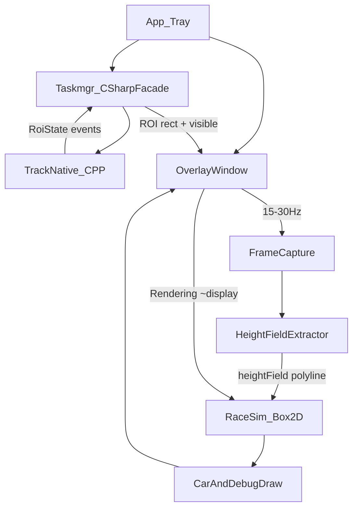

# CPURacer 实施计划

> 依据：[docs/调研报告.md](调研报告.md)  
> 范围：Win11 中文新版任务管理器 · 外部 Overlay · 不注入  
> 目标：按 M0→M1→**M1.5**→M2→M3 交付可玩原型，再做打磨与降级

---

## 0. 目标与非目标

### 0.1 目标（MVP / PoC）

- 在 Taskmgr「性能 → CPU」大图上叠加透明 Overlay  
- 从**合成帧**提取与蓝线拟合的山路 `heightField` / polyline  
- 带物理的侧视小车：贴地、可翻车；**唯一死亡 = 被卷轴带出视口**  
- 托盘常驻、标准用户（`asInvoker`）、PerMonitorV2 DPI  

### 0.2 非目标（本阶段不做）

- DLL 注入 / Hook Taskmgr  
- Win10 经典 Taskmgr 双实现  
- 逻辑处理器多图模式  
- 精美美术、联网、成就、安装器打磨（可放 M4+）  
- 以 PDH 自绘假图作为唯一赛道（仅作降级）  
- **开发期多步手工部署**（见 §0.4 硬规则）  

### 0.3 技术栈（锁定）

| 层 | 选型 |
|---|---|
| 运行时 | .NET 8 壳 + **C++/Win32 跟踪 DLL**（M1.5）；**新建独立工程，不改子模块** |
| UI | WPF 透明 Overlay + WinForms/`NotifyIcon` 托盘（跟踪核可改为原生窗） |
| 发现 | `Taskmgr.exe` → `TaskManagerWindow` → **CPU 页**大图 `CvChartWindow`（M1.5 强化页判定） |
| 跟踪 | M1 轮询（过渡）；**M1.5 起：WinEvent / 可选 SetParent 锚点 + C++**，由同一解决方案一并产出 |
| 捕获 | Windows Graphics Capture（首选）或 DPI 正确的屏幕 ROI 复制；**禁止**用 BitBlt 当蓝线来源 |
| 物理 | Box2D（如 `Box2D.NetStandard`） |
| 清单 | `PerMonitorV2`、`asInvoker`；全程 `IntPtr` 句柄 |
| 构建 | 见 **§0.4**（一行指令 / IDE 一键，无构建后拷贝） |

### 0.4 硬规则：一键构建与运行（开发期强制）

开发阶段必须满足以下任一方式即可完整构建，**禁止**构建成功后还要人工复制 DLL、配置目录、资源文件等：

| 允许 | 禁止 |
|---|---|
| Visual Studio / Rider：**生成解决方案**（点一下构建按钮） | 构建后再手动 `copy *.dll` |
| **一行**命令行构建整仓产物（推荐写进 README 的唯一命令） | 构建后再手工建/拷 `config`、探针脚本当运行时依赖 |
| 原生 DLL / 内容文件由项目引用或 `OutDir` **自动**落到 App 输出目录 | 文档要求「先编 A 再编 B 再拷到 C」作为日常路径 |
| CI 内部可多步，但对开发者**只暴露**与本地相同的一行入口 | 本地依赖「先跑 hidden 脚本再 F5」且未写入那一行入口 |

**M1.5 落地约束（适配 C++ DLL）：**

1. `CPURacer.TrackNative` **加入** `src/CPURacer.sln`，与 C# 项目同开同编。  
2. 原生输出目录配置为 App 的 `$(TargetDir)`（或等价自动复制），保证 `dotnet`/`msbuild` 生成后 `CPURacer.exe` 旁已有跟踪 DLL。  
3. 若纯 `dotnet build` 无法编译 vcxproj，则 README 的**唯一**构建命令定为  
   `msbuild src/CPURacer.sln /m /p:Configuration=Debug`  
   （或仓库根目录 `build.cmd` / `build.ps1` **单文件一行包装**，内部可调 msbuild；开发者仍只记这一条）。  
4. 运行同样一行：`dotnet run --project src/CPURacer.App`（在已构建前提下），或 F5；不要求额外工作目录摆放。  
5. 违反本条的方案（例如「编完 C++ 再手动拷进 bin」）视为不合格设计，必须改工程而不是改习惯。

---

## 1. 仓库与工程结构

```text
CPURacer/
  docs/
    调研报告.md
    实施计划.md          ← 本文
    research/            ← 探针留存，不进产品编译
  reference/
    copy-dialog-lunar-lander/   ← submodule，只读参考
    TaskmgrPlayer/              ← submodule：SetParent 播视频 / 原生跟随参考
  src/
    CPURacer.sln                ← 唯一解决方案；含 C# + TrackNative
    CPURacer.App/               ← 托盘入口、应用生命周期
    CPURacer.TrackNative/       ← C++ 跟踪 DLL（M1.5；OutDir→App）
    CPURacer.Taskmgr/           ← C# ROI 契约 / 对 TrackNative 的薄封装（M1 轮询可退役）
    CPURacer.Capture/           ← 合成帧捕获、高度场提取
    CPURacer.Overlay/           ← 透明窗、对齐、帧循环、调试描边
    CPURacer.Game/              ← 赛车物理、输入、胜负
    CPURacer.Native/            ← 共享 P/Invoke / CoordMapper
  tests/
    CPURacer.Tests/            ← 高度场/坐标换算单测（能测的部分）
```

模块依赖方向（禁止反向）：

```text
App → Overlay → Game
App → Taskmgr → TrackNative(P/Invoke)
Overlay → Capture → Taskmgr(ROI)
Game 不依赖 Win32 捕获细节（只吃 heightField + 时间步）
```

参考项目仅作对照阅读；**禁止**直接改 `reference/` 当产品代码。

---

## 2. 架构与数据流



### 2.1 坐标系约定（全项目统一）

1. **物理像素**：捕获与 `GetWindowRect` / Graphics Capture 使用  
2. **DIU**：WPF Overlay 布局（÷ DPI × 96）  
3. **世界坐标**：Box2D，原点建议图区左下，Y 向上；与参考 lunar-lander 一致便于移植心智  

换算必须集中在一个 `CoordMapper` 类，禁止各处手写。

### 2.2 帧率策略

| 通路 | 频率 | 说明 |
|---|---|---|
| 捕获 + 高度场 | 15–30 Hz | 限频，避免高刷机过热 |
| 物理步进 | 与 `CompositionTarget.Rendering` 绑定，dt 钳制 | 参考：fps 下限 30 保稳定 |
| Overlay 跟随矩形 | **事件驱动**（M1.5 WinEvent）；禁止仅靠 ≥100ms 轮询当主路径 | M1 遗留轮询仅作过渡 |

---

## 3. 里程碑计划

### M0 — 工程骨架（0.5–1 天）

**交付：**

- 解决方案可编译运行；托盘图标；空透明窗可显示/退出  
- `app.manifest`：DPI + `asInvoker`  
- README 增加「如何编译运行」小节  

**验收：** F5 出托盘；退出干净；无管理员提权提示。

**任务清单：**

- [x] 创建 `src/CPURacer.sln` 与上述项目  
- [x] 托盘菜单：开始/停止跟踪、调试开关占位、退出  
- [x] 链接调研结论到 README  

---

### M1 — 钉住 CPU 大图并跟随（2–4 天）

**目标：** Overlay 客户区与 Taskmgr 主 CPU 图（最大 `CvChartWindow`）重合。

**任务清单：**

- [x] `TaskmgrWatcher`：按进程名找 `Taskmgr.exe`；枚举 `TaskManagerWindow`  
- [x] 子树收集可见 `CvChartWindow`，按面积选最大者作为 ROI  
- [x] 可选：检测侧栏多缩略图并存，启发式确认在「性能」页  
- [x] Overlay：`AllowsTransparency`、Alpha≥1、`Topmost`、`ShowInTaskbar=false`  
- [x] 每帧/定时更新 `Left/Top/Width/Height`（物理→DIU）  
- [x] 前台逻辑：Taskmgr 或 Overlay 为前台时显示，否则移出屏幕（参考 `Top=20000`）  
- [x] 切离性能页 / 找不到大图 → Sleep  
- [x] 调试：半透明红框描边 ROI（确认对准绘图区而非含大标题的过大矩形）  

**验收：**

| 场景 | 通过标准 |
|---|---|
| 打开 Taskmgr → 性能 → CPU | Overlay 盖住大图 |
| 拖动 / 缩放窗口 | 框跟随，无明显滞后错位 |
| 切到「进程」 | Overlay 隐藏 |
| 150% DPI | 不系统性偏大/偏小 |
| 跨屏拖动（若有条件） | 记录问题；允许 M1 有小瑕疵，记入债 |

**风险：** ROI 可能含标题「% 利用率」——M1 可用手动 inset 常量，M2 再精细裁剪绘图区。

**M1 实测债务（进入 M1.5）：**

1. 拖动时红框滞后、露馅  
2. 切到内存等其它性能子页仍钉在大 `CvChartWindow` 上  
3. 切前台/失焦响应慢  
4. Taskmgr 已失焦但窗口仍可见时红框仍显示（规则应改为：非前台即隐藏）

---

### M1.5 — 跟踪加固与 C++/C# 分工（**已确认，可开工**）

**依据：** [docs/research/TaskmgrPlayer-调研.md](research/TaskmgrPlayer-调研.md) · 子模块 `reference/TaskmgrPlayer`  
**硬约束：** 必须遵守 **§0.4 一键构建**（TrackNative 进同一 `CPURacer.sln`，DLL 自动进 App 输出目录）。

**目标：** 解决 M1 四项体验问题；把**窗口发现 / 跟随 / 前台与显隐**沉到对延迟敏感的原生层，C# 保留托盘、游戏与（随后）捕获拟合。

#### 问题 → 对策

| # | 问题 | 对策方向 |
|---|---|---|
| 1 | 拖动露馅 | `SetWinEventHook(EVENT_OBJECT_LOCATIONCHANGE / MOVESIZE*)` 或学 TaskmgrPlayer：锚点窗 `SetParent` 到图表后只 `MoveWindow(0,0,w,h)`；避免 150ms 轮询 + 纯 WPF 布局追屏幕坐标 |
| 2 | 非 CPU 页仍有框 | **CPU 页判定**：不仅“最大图”；结合侧栏多缩略图布局、选中项、图表在客户区右侧主区等启发式；离开 CPU → 立即 Sleep |
| 3 | 失焦慢 | `EVENT_SYSTEM_FOREGROUND`（及可选 `EVENT_OBJECT_HIDE`）即时回调，不用 100ms 定时器作为唯一手段 |
| 4 | 失焦仍可见还显示 | 产品规则写死：**仅当 Taskmgr 主窗或其图表链为前台时显示**；失焦立即 `Top=20000` / Hide，与是否被其它窗遮挡无关 |

#### C++ / C# 边界（建议锁定）

```text
CPURacer.TrackNative (C++ DLL)
  - Find Taskmgr + CPU chart HWND
  - WinEvent hooks → ROI rect / dpi / visible flag
  - Optional: transparent child anchor via SetParent
  - Export: Start/Stop + callback or shared RoiState

CPURacer.App / Overlay / Game / Capture (C#)
  - Tray, debug chrome, race sim, height-field (M2+)
  - Consume RoiState; draw car only
```

**明确不做（本阶段）：**

- 照搬 TaskmgrPlayer 不透明视频子窗盖住整张 CPU 图（会挡住蓝线采样，与拟合玩法冲突）  
- 注入 `Taskmgr.exe`  
- 构建后手工复制 TrackNative DLL / 配置（违反 §0.4）  

**验收（相对 M1）：** ✅ **已通过**（2026-08-08）

| 场景 | 通过标准 |
|---|---|
| 快速拖动 Taskmgr | 红框无明显拖影/错位（体感贴窗） |
| 性能 → 内存 / GPU | 框消失 |
| 性能 → CPU | 框回到大图 |
| Alt+Tab / 点其它窗 | ≤1 帧量级隐藏 |
| Taskmgr 可见但非前台 | **无**红框 |
| 再激活 Taskmgr | 框立即回来 |
| 一键构建 | IDE 生成或 README 唯一一行命令后，无需再拷文件即可运行 |
| 跟随方式可切换 | 外部 Overlay / 子窗 SetParent 均可验收通过（见已知限制） |

**已知限制（单次实验，详见 [M1.5-验收-跟随与完整性.md](research/M1.5-验收-跟随与完整性.md)）：**

- 普通权限：外部 Overlay 正常；子窗常停在左上角  
- 管理员：子窗正常；外部 Overlay 可能乱飘 / 误贴其它图  

**任务清单：**

- [x] 详读 TaskmgrPlayer `SetParent`/`MoveWindow` 路径，做尖兵对比（外部 Overlay vs 透明子锚点）  
- [x] 新建 `CPURacer.TrackNative`（vcxproj 进 `CPURacer.sln`），`OutDir`/自动复制满足 §0.4  
- [x] C# 薄封装替换 M1 `Timer` 轮询主路径  
- [x] WinEvent：位置 + 前台 + 显隐  
- [x] CPU 页启发式，单测/手工表  
- [x] README：唯一构建命令 + M1.5 验收步骤  
- [x] 跟随方式可选项（外部 / SetParent 子窗）+ C++/C# 整理  
- [x] M1.5 手工验收通过；记录完整性×跟随方式限制  

**约当：** 3–5 天（含尖兵选型）。**顺序：** M1.5 完成前不进入 M2（避免在错误 ROI/错误页上做拟合）。

---

### M2 — 合成帧高度场 + 拟合验收（4–7 天）

**前置：** M1.5 验收通过（ROI 已是 **CPU 页**大图，跟随/失焦合格）。否则拟合会钉在错误页或错位矩形上。

**目标：** 调试描边与系统蓝线肉眼重合；为物理提供可信地形。

**任务清单：**

- [x] `FrameCapture`：External 主路径为自研 WGC Taskmgr window → ExtendedFrame 裁 CPU ROI（可录、无黄边、最大化贴合，2026-08-10 验收）；桌面 `BitBlt` + WDA 仅留 Child 兼容
- [x] **禁止**将 `CvChartWindow` BitBlt 结果当作蓝线来源（可用其仅验证网格/尺寸）
- [x] `HeightFieldExtractor`：
  - 高饱和蓝色描边脊评分，排除网格、淡洗色与橙色 Overlay
  - 缺失列插值；低覆盖坏帧跳过并保留上一条可靠轮廓
  - 单列 impulse 清理 + 轻度平滑，避免固定高台和削峰
- [x] 绘图区 inset：`PlotInset.DefaultWin11Cpu`（图矩形内守边 L4/T4/R4/B4）
- [ ] 环形缓冲 + **卷速估计**（相邻帧特征相关或右端新数据推进），与图滚动对齐  
- [x] Overlay 调试模式：橙色 polyline 叠在系统图上（「调试拟合线」）
- [ ] 量化：采样列上 `|y_extract - y_visual|` 相对图高；目标 **≤ 1–2%**  
- [ ] PDH 旁路读取：仅日志对比，**不驱动**主地形  
- [x] 主题切换（浅/深）冒烟：蓝色描边评分仍稳定（2026-08-08 手工通过）

**验收：** ✅ **已通过**（拟合基线 2026-08-08；External 可录屏 WGC + 最大化/无黄边 2026-08-10）

- 调试线与蓝线重合（静止 CPU 约 25% 平台、波动段峰谷都要对；含 Taskmgr 最大化）
- 遮挡 Taskmgr 时：明确 Sleep 或进入「捕获失败」状态，不画错位山
- 文档记录：捕获 API 最终选型与已知失败模式（自研 WGC / ExtendedFrame / borderless）

**退出标准未达时：** 不进入 M3 接物理（避免浮空车返工）。

---

### M2.5 — WPF External 主循环对齐 copy-dialog（已被 M2.6 取代）

**前置：** M2 拟合可用。
**目标：** External 路径对齐 `reference/copy-dialog-lunar-lander` 的高稳健帧循环；**不改 Child 模式代码**。

**做法：**

- `CompositionTarget.Rendering` → `OverlayWindow.TickExternalFrame`：每帧 `GetWindowRect` + 本地前台判定 + 捕获/拟合 + `DrawingGroup`
- TrackNative 仍只负责发现/丢失图表；External 视觉显隐以每帧本地 FG 为准（含 Overlay 自身前台仍显示）
- Child：保留 `DispatcherTimer` + `PlaceAsChild` 旧路径；托盘可切换

**结果：** 帧循环对齐，但 WPF layered window 在拖动/resize 后仍有点击与焦点振荡，不满足 M3 门禁。详见 [M2.5 记录](research/M2.5-Overlay主循环对齐.md)。

---

### M2.6 / M2.6.2 — 原生 External Overlay（✅ 已通过）

**目标：** 消除 WPF External 的焦点与 layered 重绘竞态；Child 不改。

**实现：**

- 原生 Win32 `WS_POPUP` + layered / transparent / no-activate / tool-window
- Vortice Direct2D 绘制高度场、描边与状态
- M2.6.2 实机定案：跨进程相对 Z 序与 owned popup 均被 UIPI 拒绝（错误 5）；改为原生 Topmost + Taskmgr/托盘前台可见、其它应用前台隐藏
- M2.6.1：原生 External 改用 16ms `DispatcherTimer`；不再依赖隐藏 WPF 壳的 `CompositionTarget.Rendering`
- TrackNative 继续作为发现加速层；WPF 仅保留 Child
- **2026-08-17（PR #2）：** External 进给并入 `RaceHost` 单环；本机验收延迟更好、托盘往返无回归 → 保留

**验收：** 见 [M2.6 迁移方案](research/M2.6-原生ExternalOverlay迁移.md)；托盘焦点往返手工通过（并钟后 2026-08-17 复验通过）。
**顺序：** Overlay 门禁已过；M3 接线见下。

---

### M3 — 物理赛车可玩原型（✅ 已通过）

**目标：** 能玩；规则符合调研 §1.2。**硬规则：** 不挖 M2.6.2 承重墙（Topmost / 前台显隐 / 点击穿透 / 热路径不刷托盘）。帧编排见 [M3-物理赛车.md](research/M3-物理赛车.md)（2026-08-17：RaceHost 单环已定案）。

**任务清单：**

- [x] `RaceSim`：Box2D（`Box2D.NetStandard`→Box2DX）米制世界；地形 = 世界折线 edge ← 摄像机空间 HF（续铺 + 视口同步）  
- [x] 车辆：车身 + 双轮硬轴 `RevoluteJoint` 电机；重力、摩擦；可翻车  
- [x] 卷轴：`scrollOriginPx` 视口投影；车世界坐标不动镜头；需往右开对抗卷轴  
- [x] 输入：LL hook + `GetAsyncKeyState`；W/S 无级 pedal∈[-1,1]；翻车后切断有效操控  
- [x] **死亡 / 边界**：左侧出界失败；右侧空气墙；底部原地重生（PR #2）；翻车不单独判死；R 回正  
- [x] 重开：空格或托盘；重置到视口左侧缓坡上方  
- [x] 绘制：车 + HUD（原生 Direct2D / Child WPF）；薄契约 `SetCarPose`；**不**自绘第二条山路  
- [x] 帧编排：`RaceHost` 单 60Hz（External 进给 → 物理 → `RenderNow`）；高度场经捕获/提取（2026-08-17 定案）  
- [x] 手工验收：贴地 / 翻车 / 出界 / 托盘焦点往返（2026-08-09；并钟复验 2026-08-17）  

**验收：** ✅ **已通过**（2026-08-09；管理员 + Taskmgr 前台）；并钟与体验改进 ✅（2026-08-17）

| 项 | 标准 |
|---|---|
| 贴地 | 正常路段车轮/底盘贴蓝线，无持续浮空 |
| 翻车 | 陡坡可翻；惩罚后 R 可回正 |
| 死亡 | 左侧出界失败；底部重生保留成绩；重开可用 |
| 滚动 | CPU 波动时需主动「往前开」才不易被卷走 |
| 焦点 | Taskmgr 前台可操作；失焦不挡点击；托盘往返 Overlay 不被盖住 |
| 同步 | 跳变延迟相对双时钟基线明显改善（2026-08-17） |

---

### M4 — 玩家壳 + 降级与发布 ✅ 已通过（2026-08-09）

在 M3 可玩后做。**不单插 UX 阶段**：与 lunar-lander 的差距主要在默认 Play、循环与提示，和降级/发布同属「可分享交付」，合入本里程碑。详见 [M4-玩家壳与发布.md](research/M4-玩家壳与发布.md)。

**本阶段关闭范围：** A/B 玩家壳与开局路径 + 管理员键位提示 + M2.6.2 门禁承袭。PDH / ROI fallback / 自检 / 单文件发布刻意延后为后续小修，不挡关闭。

#### A. Play / Debug 分离

- [x] 默认 **Play**：关拟合线、关调试描边；诊断 HUD（`cap=` / `source=` / `keys=`）不进玩家画面  
- [x] 托盘「高级 / 调试」才开橙折线与红框；Tab（或等价）切换 debug  
- [x] 去掉「有车就强制画 chrome」；玩家 HUD 只用短文案（速度 / 目标 / 提示）  
- [x] 车与字色重做一版可读配色（非验收绿块 + 大红诊断字）

#### B. 玩法循环与提示（对齐 lunar-lander 量级，不做升级树）

- [x] 开局提示层：场地就绪后中央 Figgle（`SPACE` / 中英短句；External 穿透，不用点 Overlay）  
- [x] 极简循环：存活距离 + 出界结算；中央 Figgle `GAME OVER`；Space / 托盘重开  
- [ ] （可选）燃料或「过热」消耗，用完削弱动力——有则更好，无则用距离即可  
- [x] **启动即监视** Taskmgr（对齐 lunar `_watcher.Start`）；「暂停/恢复监视」仅在高级  
- [x] 托盘玩家项：开始/停止、重开、退出；tip 玩家化；工程状态仅高级菜单  
- [x] 推翻「请先开始跟踪」心智；无图时提示打开性能/CPU  
- [x] en / zh-Hans 本地化（托盘、MessageBox、中央提示）；高级 → 语言可切换（进程内）

#### C. 降级、稳健与发布

- [ ] （延后）捕获连续失败 → PDH 影子山路 + 明确「降级模式」提示  
- [ ] （延后）找不到 `CvChartWindow` → 客户区比例裁剪 fallback  
- [x] 完整性不匹配（管理员 Taskmgr + 标准用户游戏）→ 检测并提示以管理员重开  
- [ ] （延后）启动自检（探针式）：写 `docs/research/self-check` 日志  
- [x] 已知问题写入 research/README（单文件发布 / 签名仍待）  

**验收（2026-08-09 关闭）：**

| 项 | 标准 | 结果 |
|---|---|---|
| Play 默认 | 启动即监视；无橙拟合线/红框；能看懂「开 CPU 图 → Space」 | ✅ |
| 循环 | 有目标感（距离/时间）+ 成败文案 + 一键重开 | ✅ |
| 降级 | 捕获失败有提示；PDH 续玩延后 | ✅ 提示到位 / PDH 延后 |
| 键位 | 非管理员对着高 IL Taskmgr 时有提示，不静默无响应 | ✅ |
| 门禁 | 托盘往返后 Overlay 仍符合 M2.6.2 | ✅ |

**观感小修 — Figgle + i18n ✅（2026-08-09）：** Overlay 中央开局/结束 ASCII；`CPURacer.Localization` en/zh-Hans；托盘语言切换；门禁承袭。详见 [M4-玩家壳与发布.md](research/M4-玩家壳与发布.md)。

---

## 4. 关键模块设计要点

### 4.1 TaskmgrWatcher

```text
Poll / WinEvent（MVP 用 100–200ms 轮询即可）
  → Process.GetProcessesByName("Taskmgr")
  → Enum top-level ClassName == TaskManagerWindow
  → Enum children ClassName == CvChartWindow && visible
  → Pick max (width*height)
  → Emit ChartRoiChanged(rectPx, hwnd, dpi)
```

文案「性能」「CPU」只作可选加分，不作唯一条件。

### 4.2 HeightFieldExtractor（拟合硬路径）

输入：ROI 位图（合成帧）  
输出：`heightField[0..w)` ∈ [0,1]，及可选 `ScrollVelocityPxPerSec`

失败条件：主题色丢失、有效列命中率过低、ROI 尺寸突变 → 通知 Overlay 进入失败态。

### 4.3 RaceSim 与死亡

- 视口 = 当前 Overlay/图表世界矩形  
- `IsOutOfView(body)` → `Dead`  
- 翻车：`Abs(angle) > threshold` 或轮全部离地过久 → `ControlsDisabled`  

### 4.4 从参考项目可抄 / 不可抄

| 可借鉴 | 不可照搬 |
|---|---|
| Overlay 透明、焦点、`Top=20000` | `OperationStatusWindow` / `ChartView` 类名 |
| `GameInterface` 式 Init/Update | BitBlt + 自底向上实心色带算法 |
| Box2D 分块地形脏更新 | 固定 395×85 世界 |
| 托盘壳 | `NativeWindowHandle` 截断为 `int` |

---

## 5. 测试与验收矩阵

| ID | 类型 | 内容 | 阶段 |
|---|---|---|---|
| T1 | 手工 | Overlay 对准大图 | M1 |
| T2 | 手工 | 拖动/缩放跟随 | M1 |
| T3 | 手工 | 调试线拟合蓝线（平台+尖峰） | M2 |
| T4 | 手工 | 浅色/深色主题 | M2 |
| T5 | 手工 | 贴地无浮空、翻车、出界死亡 | M3 |
| T6 | 单测 | `CoordMapper` 像素↔世界 | M1+ |
| T7 | 单测 | 合成图 fixture → heightField 形状 | M2 |
| T8 | 手工 | 遮挡/最小化 Sleep | M2–M3 |
| T9 | 手工 | 150% DPI | M1–M3 |

测试夹具：将 `docs/research/capture-*.png` 中可用帧（或新录合成帧）纳入 `tests/Fixtures/`。

---

## 6. 风险与缓冲

| 风险 | 缓解 | 缓冲 |
|---|---|---|
| Graphics Capture 权限/黑帧 | 早做尖兵 demo；准备 CopyFromScreen fallback | M2 +1–2 天 |
| ROI 含非绘图区导致纵轴错 | inset 标定工具（调试拖拽边距） | M2 内 |
| 卷速难对齐 | 先固定车 X、只滚地形；再调手感 | M3 |
| Win11 更新改类名 | 版本表 + 多策略；自检失败友好提示 | M4 |
| 物理手感差 | 参数表（重力、摩擦、扭矩）可托盘调节 | M3 |
| C++/C# 双工具链构建摩擦 | **§0.4**：同一 sln + 自动 OutDir；README 只留一行 msbuild/build.cmd | M1.5 内必须闭环 |
| 误用最大图钉到内存页 | M1.5 CPU 页启发式；M2 禁止在未判定 CPU 时捕获 | M1.5 |

---

## 7. 建议排期（单人全职约当）

| 阶段 | 约当 | 累计 |
|---|---|---|
| M0 | 0.5–1 天 | 1 |
| M1 | 2–4 天 | 5 |
| **M1.5** | **3–5 天** | **10** |
| M2 | 4–7 天 | 17 |
| M3 | 5–8 天 | 25 |
| M4（可选·玩家壳+发布） | 5–8 天 | 33 |

顺序强制：**M1.5 跟踪体验达标 → M2 拟合验收通过 → 再开 M3 物理 →（可选）M4 玩家壳与发布**。M2 前可用假正弦山路并行试验车辆，但不得当作完成。

---

## 8. 开工检查清单（M0 第一天）

1. `git submodule update --init --recursive`（参考只读）  
2. 安装 .NET 8 SDK / VS 2022  
3. 本机打开 Taskmgr → 性能 → CPU，确认大图可见  
4. 新建 `src/CPURacer.sln`，跑通托盘空壳  
5. 把本文与调研报告链到根 README  

---

## 9. 文档维护

| 变更 | 动作 |
|---|---|
| 捕获方案定案 | 更新本文 §3 M2 与调研报告附录 |
| 里程碑完成 | README「状态」改为当前 M 级 |
| 发现新 Win11 类名 | 写入 `TaskmgrWatcher` / TrackNative 版本表 + research 笔记 |
| 构建入口变更 | **必须**同步 README 唯一命令，且仍满足 §0.4 |

---

**一句话：** 先钉框（M1），再**加固原生跟踪与 CPU 页判定（M1.5）**，再证蓝线拟合（M2），再上物理车（M3 ✅），再 **M4 玩家壳 ✅**；Figgle + en/zh ✅；后续为降级/发布小修。
